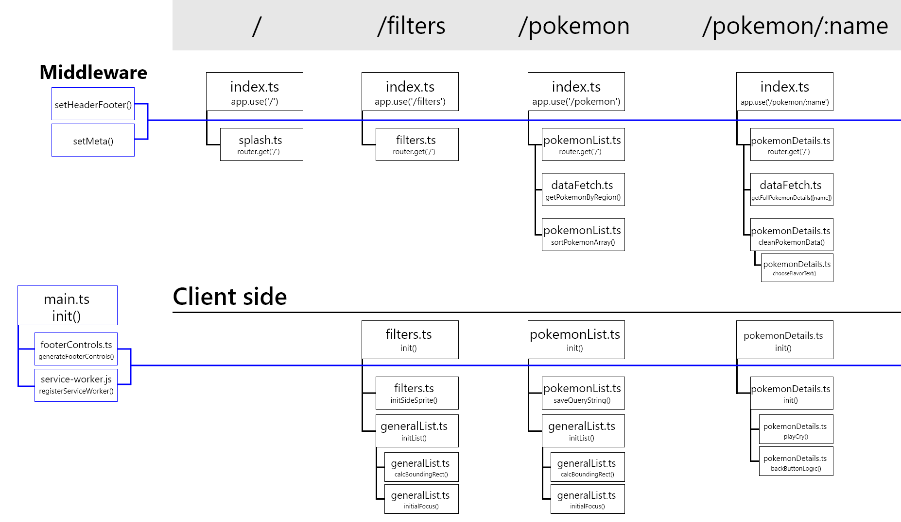

# Progressive Web App


<p align="center">
	
</p>

## Week 1

Tijdens week 1 van het project heb ik de meeste functionaliteit van het [vorige project](https://github.com/Laurens256/web-app-from-scratch-2223/) over gezet naar de server. Uiteindelijk ging dit soepeler dan ik had gedacht. Omdat we op de server gebruik maken van Express, hoeven we zelf niets / weinig te doen voor routing, query params, dynamic routes etc. In de komende weken zal ik verder gaan met de keyboard controls, die werken nu nog maar gedeeltelijk.

## Week 2

Tijdens week 2 heb ik de keyboard controls afgerond. Dit was voor dit project simpeler dan wanneer de site client side gerendered werd. Wanneer de pagina wordt gereload voor iedere route change, hoeven oude window event listeners niet worden verwijderd omdat dit automatisch gebeurd tijdens reload.

Verder ben ik deze week bezig gegaan met caching en het opzetten van de PWA. Ik denk dat dit best aardig is gelukt maar ik weet niet helemaal zeker of ik alles juist heb geimplementeerd omdat de site er niet veel sneller van is geworden. Het cachen van requests gebeurt door middel van een service worker. Deze service worker cloned responses van uitgaande requests en slaat deze data op. Wanneer dezelfde request opnieuw wordt gemaakt, wordt de response uit de cache geserveerd in plaats van opnieuw te fetchen. Hieronder een stukje code wat dit mogelijk maakt.
```ts
self.addEventListener('fetch', async (event: FetchEvent) => {
	const response = await caches.match(event.request);
	if (response) {
		return response;
	}
	try {
		const networkResponse = await fetch(event.request);
		if (
			networkResponse &&
			networkResponse.status === 200 &&
			networkResponse.type === 'basic'
		) {
			const cache = await caches.open(CACHE_NAME);
			await cache.put(event.request, networkResponse.clone());
		}
		return networkResponse;
	} catch (error) {
		console.error('Fetch failed:', error);
		throw error;
	}
});
```

## Week 3
In week 3 heb ik de service worker eigenlijk helemaal opnieuw geschreven zodat deze enkel een statische pagina serveerd wanneer er geen netwerk beschikbaar is. Op deze pagina worden wat Pokémon weetjes getoond totdat er weer een netwerk beschikbaar is. Dit leek me wat simpeler om correct te implementeren. Hieronder een deel van de service worker code.
```js
self.addEventListener('fetch', async (event) => {
	event.respondWith(
		fetch(event.request)
			.then((response) => {
				return response;
			})
			.catch(async () => {
				// If there's no network, serve the cached response
				const response = await caches.match(event.request);
				if (response) {
					return response;
				} else {
					// If there's no cached response, serve the fallback HTML page
					return caches.match('/offline.html');
				}
			})
	);
});
```

Verder ben ik deze week bezig geweest met het afronden van wat kleine details. Zo heb ik de keyboard controls overal geimplementeerd en overal ook met de muis klikbaar gemaakt.

## Activity diagram
<p align="center">
 
</p>